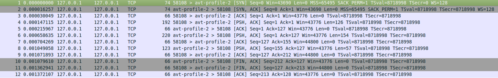
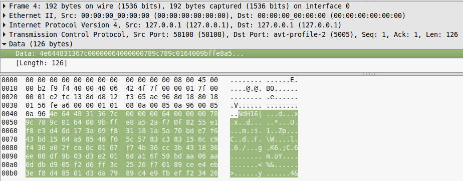

# Walkthrough: FORENSICS 200 – I’M AFRAID OF A GH0ST NAMED POISON IVY CTF

Writeup for decrypting the gh0st packets of the Poison Ivy RAT

## Prerequisites

```
pip install python-camellia
```


## Writeup

### Step 1. Open pcap file in Wireshark and detect gh0st protocol



* 5 bytes identifier -> NdH16

* 5 bytes compressed packet length

* 5 byes uncompressed packet length

* compressed packet content

### Step 2. Analyze packets and detect Poison Ivy RAT:



* detected 3 gh0st packets => Poison Ivy 3 step process: Step 1 and Step 2 is the handshake process between Command & Control server and the infected machine; Step 3 is the actuak data being sent, which we are interested in

* payload is encrypted using Camellia algorithm

### Step 3. Run python script to extract data from third packet decompress it and decrypt it:

* skip the first two packets (handshake)

* extract data section from the third packet

* decompress the data

* decrypt the data

* flag is: **ndh2k16_babafafa58941**

```
python3 decrypt.py
```
Output:
```
b'ndh2k16_babafafa5894\x00\x00\x00\x00\x00\x00\x00\x00\x00\x00\x00\x00'
```

